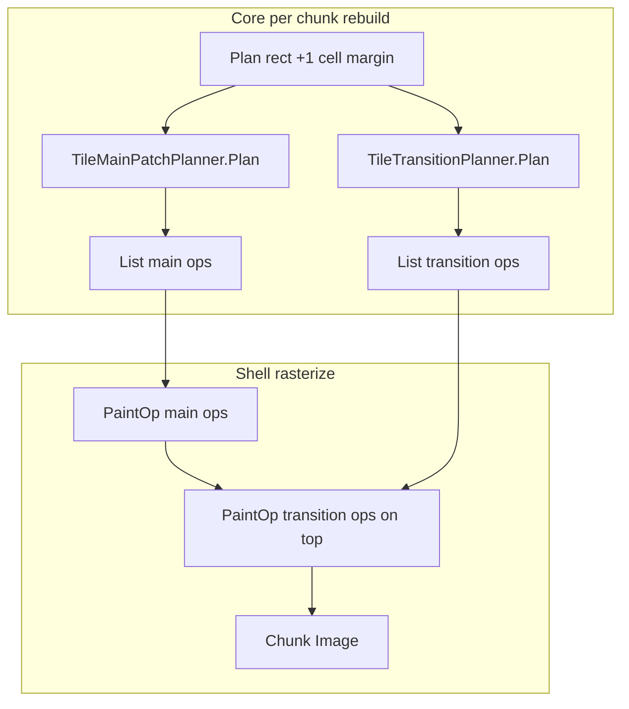

> **STATUS: COMPLETE (REV 56, 2026-05)**  
> Do not use as active work — see [docs/shell-feature-revision-log.md](../../../docs/shell-feature-revision-log.md) and [docs/architecture.md](../../../docs/architecture.md) § Terrain rendering (transitions).

---
name: Phase 4 transitions
overview: Add Factorio-style edge transitions (Side sprites first, then corners), two-pass chunk painting, neighbor-chunk dirty propagation, and margin sampling so category boundaries look continuous across 32×32 chunk seams.
todos:
  - id: p4-groups
    content: TerrainTransitionGroup + pair rules; collapse categories for transition lookup
    status: completed
  - id: p4-planner
    content: TileTransitionPlanner (4-neighbor edges, Side ops) + unit tests
    status: completed
  - id: p4-atlas
    content: Atlas transition strips + TerrainAtlasCatalog regions for Side (4 dirs × variants)
    status: completed
  - id: p4-raster
    content: Two-pass chunk rasterize (main then transitions); transition color fallback
    status: completed
  - id: p4-dirty
    content: MarkTerrainChunkDirtyAt + neighbor chunks on boundary edits
    status: completed
  - id: p4-docs-rev52
    content: REV 52, architecture.md transition rules, shell revision log
    status: completed
isProject: false
---

# Phase 4 — Edge transitions & chunk seam polish

## Goal

Soften **category boundaries** (especially **water ↔ land / coast**) with Factorio-style **transition sprites** drawn **on top of** Phase 3 main patches. Fix **chunk seam** artifacts by using the existing **1-cell planning margin** for transition sampling and **dirtying neighbor chunks** when edge cells change.

**Depends on:** Phase 0–3 ([`TileMainPatchPlanner`](src/Core/Maps/Rendering/TileMainPatchPlanner.cs), [`TerrainChunkRasterizer`](src/Godot/Terrain/TerrainChunkRasterizer.cs), [`TerrainBakeRasterizer.PaintOp`](src/Godot/Terrain/TerrainBakeRasterizer.cs), [`TerrainAtlasCatalog`](src/Godot/Terrain/TerrainAtlasCatalog.cs), north-up Y flip in `ChunkPatchOriginY`).

**Does not include:** `Main8x8`, transition weight tables in `config.ini`, `TileMapLayer`, 3D quad drawer, full per-category-pair atlas (10×10 matrix), `DoubleSide` / `UTransition` / `OTransition` (Phase 4b stretch), decor [`TileSpriteRole.Overlay`](src/Core/Maps/Rendering/TileSpriteRole.cs).

---

## Problem today (after Phase 3)

| Symptom | Cause |
|---------|--------|
| Hard stair-steps at water/land | Main patches are uniform-category rectangles; no edge blend art |
| Slight mismatch at chunk borders | Margin cells are **planned** but **clipped** when painting; neighbor chunk not rebuilt when only the adjacent chunk’s edge tile changes |
| Transitions invisible in color mode | No boundary-specific color pass |

Phase 3 intentionally deferred transitions so global main anchors could land first.

---

## Design principles



| Rule | Rationale |
|------|-----------|
| **Two raster passes** | Main patches first, transitions second — no change to `TileDrawOp` sort fields |
| **Transition groups** | Collapse 10 `TerrainRenderCategory` values to a few groups (Water / Ground / Blocked / Empty) so atlas + rules stay tractable |
| **4-neighbor edges only (v1)** | N/E/S/W `Side` sprites; corners (`OuterCorner` / `InnerCorner`) in Phase 4b if time |
| **Transition on “inner” cell** | Cell `(gx, gy)` owns the sprite; sprite faces the **neighbor** with a different group |
| **Same global grid** | Transition at `(gx, gy)` uses categories sampled at **cell centers** (same as main planner) |
| **Margin paints transitions** | Allow `PaintOp` for transition ops whose footprint overlaps the **1-cell margin**; still **clip** to chunk image bounds (same as main) |
| **Neighbor dirty** | Editing `(gx, gy)` marks **all chunks** whose AABB touches that cell |

---

## 1. Core — transition groups & pair rules

**New:** [`src/Core/Maps/Rendering/TerrainTransitionGroup.cs`](src/Core/Maps/Rendering/TerrainTransitionGroup.cs)

```csharp
public enum TerrainTransitionGroup : byte
{
    Water,
    Ground,   // Land, Coast, Hill, ForcedLand*, etc.
    Blocked,
    Empty,
}

public static class TerrainTransitionGrouping
{
    public static TerrainTransitionGroup FromCategory(TerrainRenderCategory c);
    public static bool NeedsTransition(TerrainTransitionGroup a, TerrainTransitionGroup b);
}
```

**v1 `NeedsTransition`:** true only for `Water ↔ Ground` (optional: `Ground ↔ Blocked`). Same-group neighbors → no op.

Document collapse table in code comment (maps `ShallowWater`/`DeepWater`/`ForcedWater` → `Water`, etc.).

---

## 2. Core — `TileTransitionPlanner`

**New:** [`src/Core/Maps/Rendering/TileTransitionPlanner.cs`](src/Core/Maps/Rendering/TileTransitionPlanner.cs)

**API:**

```csharp
public static class TileTransitionPlanner
{
    public static void Plan(
        FloorSlice floor,
        int gx0, int gy0, int lw, int lh,
        ITerrainEvaluator evaluator,
        in TerrainNoiseConfig terrain,
        int worldSeed,
        int variantCount,
        List<TileDrawOp> destination);
}
```

**Algorithm** (over planning rect, same as chunk margin-expanded box):

1. For each cell `(gx, gy)` in rect with a tile:
   - Resolve `TerrainRenderCategory` at cell center → `innerGroup`.
   - For each of 4 directions (N, E, S, W), sample neighbor cell `(gx+dx, gy+dy)` (use `floor.Contains`; outside floor → `Empty` group).
   - If `NeedsTransition(innerGroup, neighborGroup)`:
     - Pick `TileSpriteRole.Side` (Phase 4b adds corners from 2-neighbor masks).
     - **Sprite category:** use `inner` category for atlas row (or dedicated “transition row” per pair — see atlas §).
     - **Direction:** encode in new field on draw op (below).
     - Variant from `TileVariantSelector` at `(gx, gy)`.
     - Emit `TileDrawOp` with `SizeCells = 1`, layer from `TileSpriteResolver.DrawLayerFor(innerCategory)`.

**Direction encoding (choose one in implementation):**

- **Option A (preferred):** extend `TileDrawOp` with optional `TransitionFacing?` (`North`/`East`/`South`/`West`) — clean for atlas lookup and tests.
- **Option B:** add `SideNorth`…`SideWest` to `TileSpriteRole` — no struct change, noisier enum.

**Tests:** [`tests/SpecialPG.Core.Tests/TileTransitionPlannerTests.cs`](tests/SpecialPG.Core.Tests/TileTransitionPlannerTests.cs)

| Test | Assert |
|------|--------|
| `Water_north_of_land_places_side_on_land` | Land cell south of water emits `Side` facing North |
| `Same_group_no_transition` | Land–land, water–water → zero ops |
| `Deterministic` | Same seed/rect → identical ops |
| `Planner_respects_floor_bounds` | Neighbor outside floor treated as Empty |
| `Does_not_cover_main_patch_cells_twice` | Transitions are separate ops; main planner unchanged |

Keep [`TileMainPatchPlannerTests`](tests/SpecialPG.Core.Tests/TileMainPatchPlannerTests.cs) green.

---

## 3. Atlas — Side transition strips

**Extend** [`scripts/gen_terrain_placeholder_atlas.py`](scripts/gen_terrain_placeholder_atlas.py):

- Per **Ground** category row (or one shared “land-water” transition band): add strip with **4 directions × 4 variants** (32×32 each), e.g. 128×32 px band.
- Visual: obvious blend strip (e.g. water-blue → land-green gradient per direction) so seams are visible in dev.

**Update** [`TerrainAtlasCatalog.BuildRegionTable`](src/Godot/Terrain/TerrainAtlasCatalog.cs):

- `TryGetSideRect(category, facing, variant, out Rect2I)` or map `TileSpriteKey(category, Side, variant)` + facing index in variant column layout.
- Document pixel layout in catalog constants (`TransitionStripHeight = 32`, etc.).

Regenerate [`terrain_atlas.png`](src/Godot/art/terrain/terrain_atlas.png).

**Scope limit:** one transition art set for all `Water ↔ Ground` pairs; shallow vs deep water still use **inner cell category** for main tiles only.

---

## 4. Shell — two-pass paint & transition fallback

**Change** [`TerrainChunkRasterizer.BuildChunkImage`](src/Godot/Terrain/TerrainChunkRasterizer.cs):

1. Build `mainOps` and `transitionOps` lists (capacity hints: `lw*lh/4` and `lw*lh`).
2. `TileMainPatchPlanner.Plan(..., mainOps)`.
3. `TileTransitionPlanner.Plan(..., transitionOps)` on **same** `planGx0/planGy0/planLw/planLh`.
4. `foreach` main → `PaintOp`; then `foreach` transition → `PaintOp` (same clip/Y-flip path).

**Change** [`TerrainBakeRasterizer.PaintOp`](src/Godot/Terrain/TerrainBakeRasterizer.cs):

- If `TileDrawOp` has facing + `Side` role: select atlas sub-rect for that facing (catalog helper).
- **Color fallback:** when sprites off or rect missing, blend `TerrainVisualColor` at cell center toward neighbor center (reuse coast-style lerp from `TerrainVisualColor` / `TerrainAppearance`, or 50% inner / 50% neighbor RGB for v1).

**Cache bump:** [`TerrainChunkView.MainPatchPlannerVersion`](src/Godot/Terrain/TerrainChunkView.cs) → rename or add `TerrainPlannerVersion = 2` covering transition planner.

---

## 5. Shell — neighbor chunk dirty propagation

**Change** [`GameRoot.MarkTerrainChunkDirtyAt`](src/Godot/GameRoot.cs):

```csharp
// After MarkChunkDirty(cx, cy):
if (lx == 0)              MarkChunkDirty(cx - 1, cy);
if (lx == chunkWidth - 1) MarkChunkDirty(cx + 1, cy);
if (ly == 0)              MarkChunkDirty(cx, cy - 1);
if (ly == chunkHeight - 1) MarkChunkDirty(cx, cy + 1);
```

Use `floor.ChunkWidth/Height` and local `(lx, ly)` from `ResolveChunk` (add package-visible helper on `FloorSlice` if needed).

Apply same neighbor fan-out when map editor / debug `slice.Set` already calls `MarkTerrainChunkDirtyAt`.

**Optional stretch:** when **only** `SyncVisible` brings a new chunk into view, no extra work (rebuild is already dirty-first).

---

## 6. Docs and REV 52

| File | Update |
|------|--------|
| [`GameRoot.cs`](src/Godot/GameRoot.cs) | `ShellFeatureRevision = 52`; changelog line |
| [`docs/shell-feature-revision-log.md`](docs/shell-feature-revision-log.md) | REV 52 |
| [`docs/architecture.md`](docs/architecture.md) | Transition groups, two-pass paint, neighbor dirty, margin role |

---

## 7. Verification

| Check | How |
|-------|-----|
| Unit tests | `dotnet test` — transition planner + existing main/resolver tests |
| Build | `dotnet build src/Godot/SpecialPG.csproj` |
| Sprites on | `terrain_use_sprites=true`; coastlines show directional blend strips, not raw main-patch cuts |
| Chunk seams | Edit water tile on chunk border → both chunks refresh; pan across border — no 1-cell stale strip |
| Color mode | Boundary cells show tint blend (weaker than sprites OK for v1) |
| HUD | `TERR SPR` still valid; planner version bump forces chunk rebuild once |

---

## 8. Phase 4b (follow-up, same milestone family)

| Item | Notes |
|------|--------|
| `OuterCorner` / `InnerCorner` | 8-neighbor bitmask → corner roles (Factorio `outer_corner` / `inner_corner`) |
| `DoubleSide`, `UTransition`, `OTransition` | Only if bitmask table warrants |
| Per-pair atlas rows | Shallow vs deep water transitions |
| `TransitionMarginCells = 2` | Only if 1-cell margin insufficient for wide transition art |

---

## 9. Out of scope (Phase 5+)

- `Main8x8` patches
- `terrain_transition_*` config.ini toggles / weights
- Shader-based terrain (single material for whole floor)
- Entity / decor layer compositing

---

## Implementation order

1. `TerrainTransitionGroup` + pair rules + tests for grouping
2. `TileTransitionPlanner` + unit tests (Side only)
3. Atlas script + catalog Side regions + PNG regen
4. `TileDrawOp` facing field (or role enum extension) + `PaintOp` facing lookup + color fallback
5. Two-pass `TerrainChunkRasterizer` + planner version bump
6. `MarkTerrainChunkDirtyAt` neighbor fan-out
7. REV 52 + architecture.md

**Estimated diff:** ~4 Core files, ~4 Shell files, atlas PNG regen, ~1 test file, docs.
